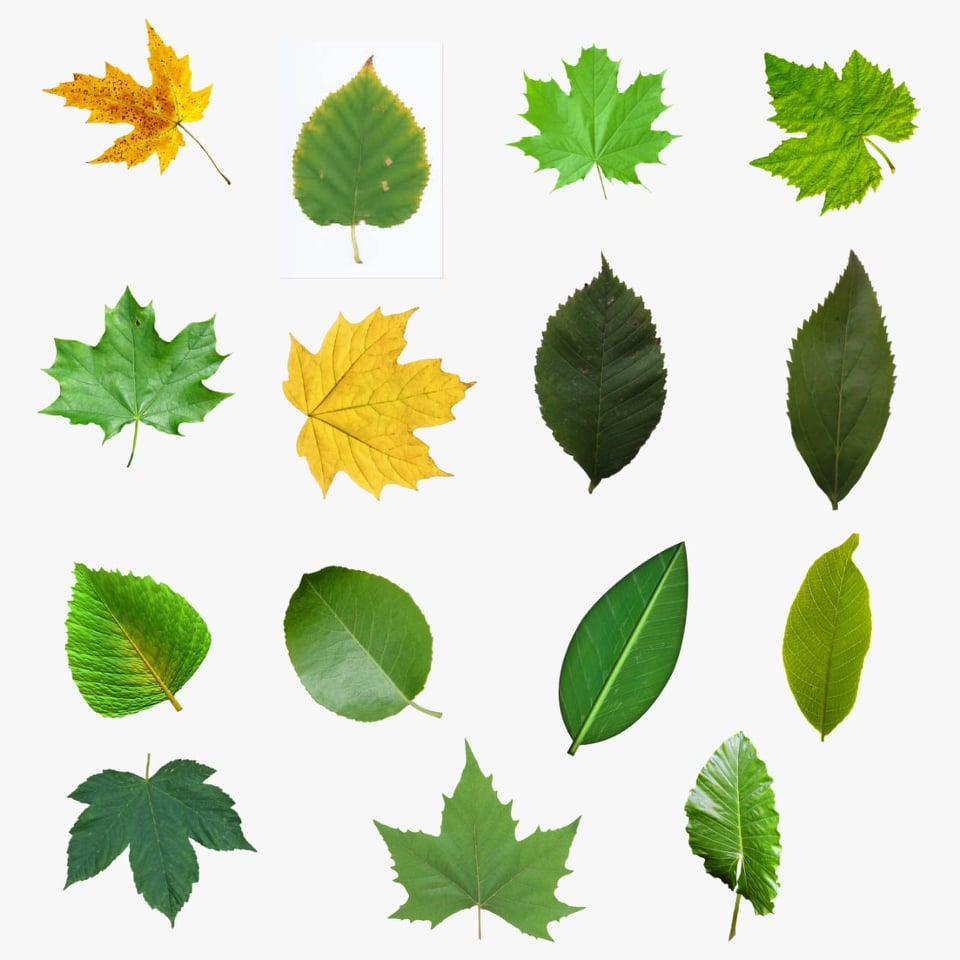
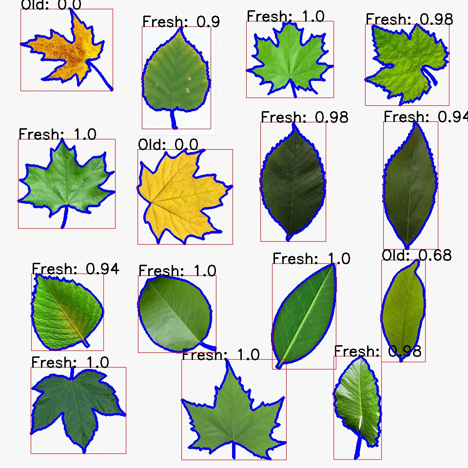
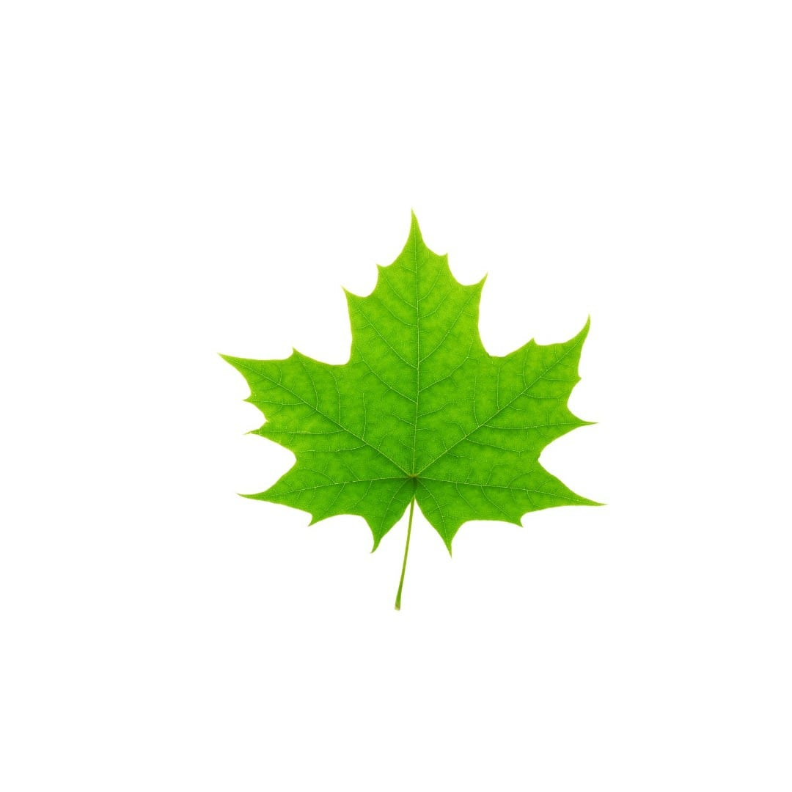
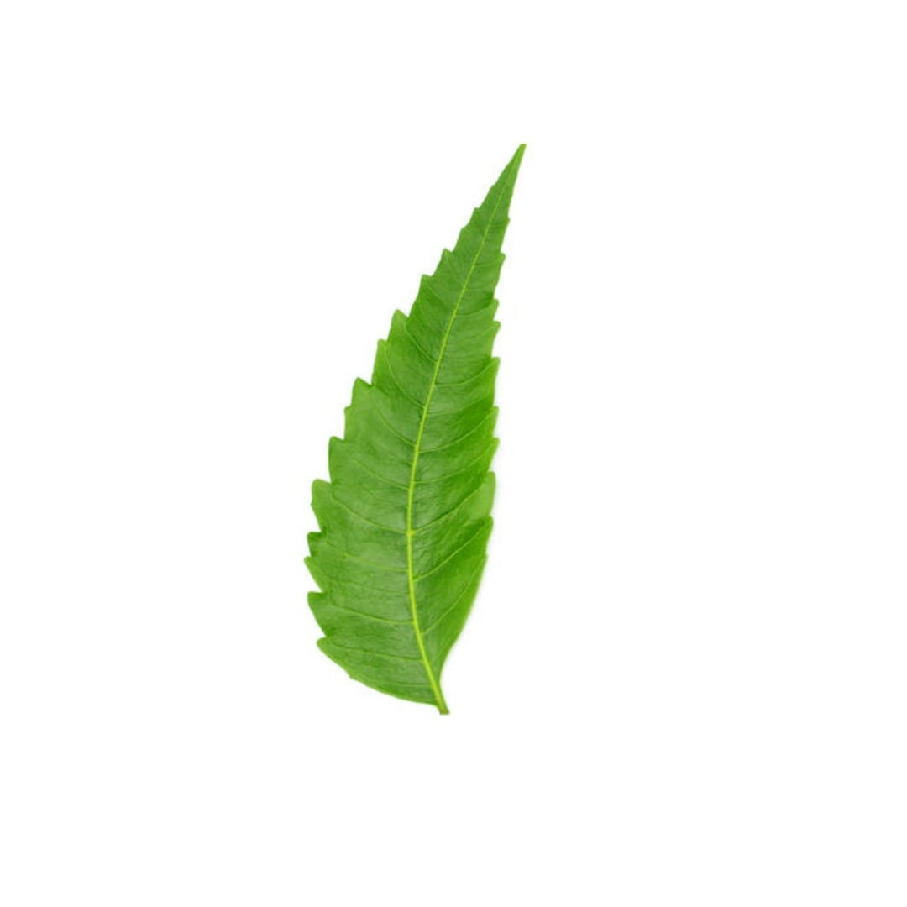
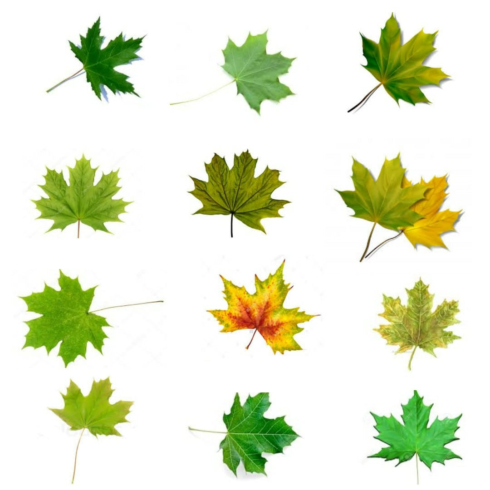
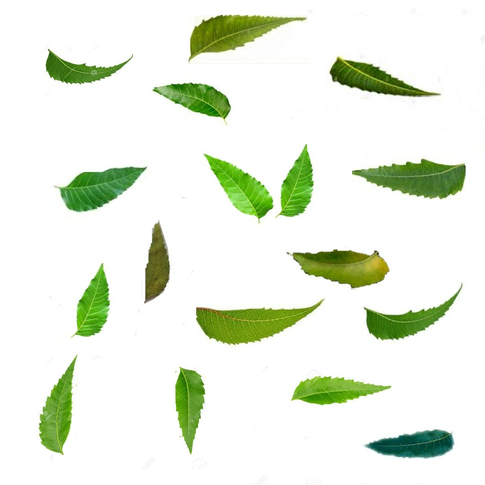
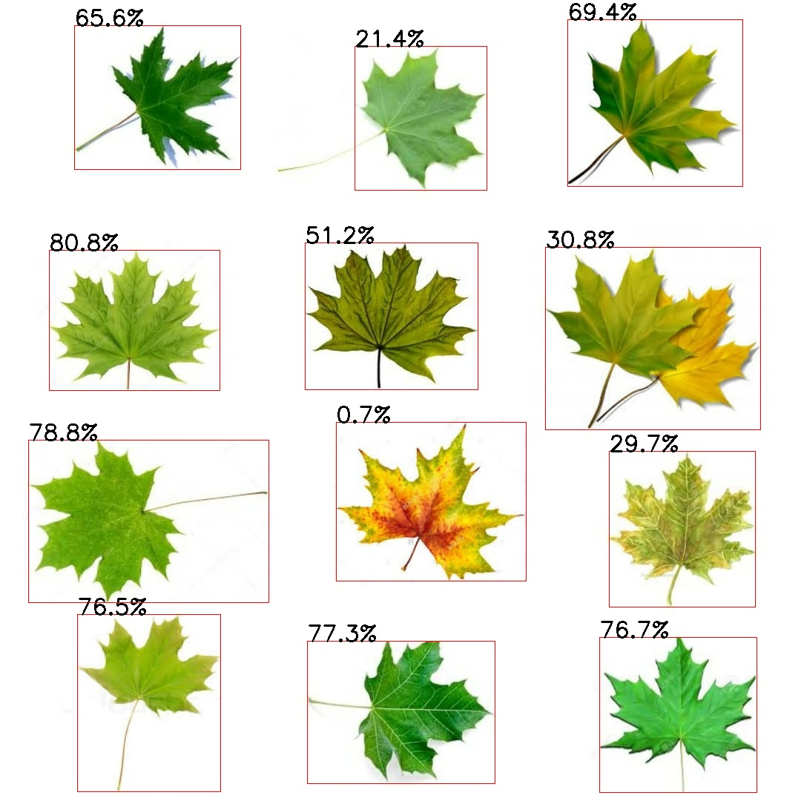

# Invicta 2020 solution
This is my solution attempt for Invicta 2020 (Image processing/OpenCv Hackathon) conducted by robotics club IIT Guwahati.
#### I bagged rang 2 among 479 participants in this competition

This hackathon had 2 levels/questions whose complete problem statement can be found in `INVICTA2020_ProblemStatement.pdf`.

### Level 1

We had to draw a contour around each leaf and calculate whether it is fresh or old based on green percentage >70%.
#### My solution

### Level 2
We were given image of perfect leaf of Maple and of Neem. We were also given image of set of imperfect Maple and Neem leafs, and we had to label how close they are to perfect leaf.
Perfect Maple | Perfect Neem
:------------:|:------:
 |

Maple Leaves| Neem Leaves
:------------:|:------:
 |

#### My solution

Maple Leaves| Neem Leaves
:------------:|:------:
 |

#

> ### For detailed solution explaination, refer to my code, I have everything with comments.

